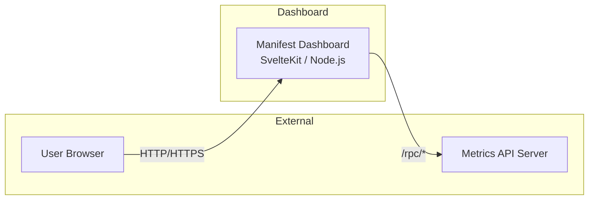

<h1 align="center">Manifest Dashboard</h1>

<p align="center">
  
</p>

A modern dashboard featuring:

- TypeScript
- Skeleton UI components
- Theming (light/dark)

## Tech Stack

- **Framework:** SvelteKit with TypeScript
- **Styling:** Tailwind CSS + Skeleton UI
- **Charts:** LayerChart + D3.js
- **Package Manager:** Bun
- **Runtime:** Node.js

## Network Architecture



The dashboard acts as an intermediary between users and the Metrics API Server:

1. **User Browser** - Accesses the dashboard UI
2. **Manifest Dashboard** - SvelteKit application that renders the UI and fetches data server-side
3. **Metrics API Server** - Backend service providing metrics data (configured via `VITE_RPC_PROXY_TARGET`)

All `/rpc/*` requests from the dashboard are proxied to the Metrics API Server. This server-side proxy keeps the API server address internal and not exposed to clients.

## Getting Started

Clone this repository and install dependencies:

```bash
git clone https://github.com/liftedinit/manifest-dashboard.git
cd manifest-dashboard
bun install
```

## Development

Start the development server:

```bash
bun dev
```

Run type checking:

```bash
bun run check
bun run check:watch  # Watch mode
```

## Environment Variables

Create a `.env` file in the root directory and add your environment variables. For example:

```env
VITE_RPC_PROXY_TARGET=http://your-api-server:3000
NETWORK=testnet
LAUNCH_DATE=2024-01-01T00:00:00Z
SITE_DOMAIN=https://metrics.liftedinit.tech
```

The `VITE_RPC_PROXY_TARGET` variable is used to set the target for the RPC proxy. This is the URL of your API server that the application will communicate with.

The `NETWORK` variable specifies the network you are working with (e.g., `mainnet`, `testnet`, etc.). 

The `LAUNCH_DATE` variable is used to set the **mainnet** launch date. Some **mainnet** data prior to this date will not be displayed in the dashboard.

The `SITE_DOMAIN` variable is used to set the domain of the site. This is useful for generating the sitemap.

Restart the dev server after changing `.env`.

## Building for Production

Build the project for production:

```bash
bun run build
```

Preview the production build:

```bash
bun run preview
```

## Production

Set the `VITE_RPC_PROXY_TARGET` environment variable to the API server URL in a `.env` file. This is required for the application to function correctly in production.

```env
VITE_RPC_PROXY_TARGET=http://your-api-server:3000
```

The API server address should be an internal address as the data is retrieved server-side.

Build the production build using

```bash
bun run build
```
This will create an optimized build in the `build` directory. Run the server using

```bash
node build
```

You can change the port by setting the `PORT` environment variable:

```bash
PORT=3001 node build
```

You can tell the application where the application is being served by setting the `ORIGIN` environment variable:

```bash
ORIGIN=http://localhost:3001 node build
```

You can find more information in the [Svelte Node servers](https://svelte.dev/docs/kit/adapter-node) documentation.

## Docker

A multi-stage Dockerfile is provided for containerized deployments.

### Build

Create a `.env` file with the required environment variables, then build the image:

```bash
docker build -t manifest-dashboard .
```

### Run

```bash
docker run -p 3000:3000 \
  -e VITE_RPC_PROXY_TARGET=http://your-api-server:3000 \
  manifest-dashboard
```

The container exposes port 3000 by default. Override with `-e PORT=<port>` and update the `-p` mapping accordingly.
